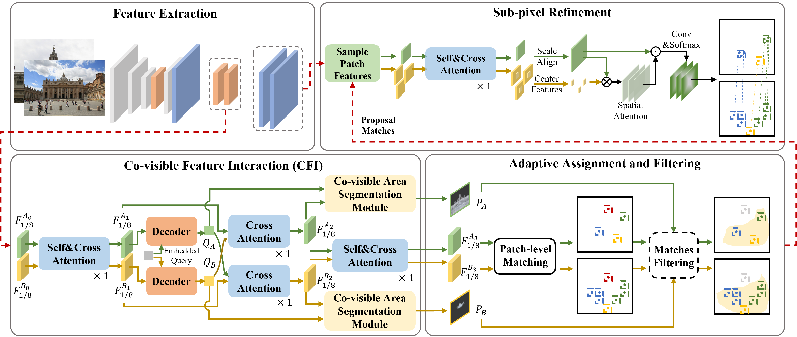

# AdaMatcher: Adaptive Assignment for Geometry Aware Local Feature Matching
### [Paper](https://arxiv.org/abs/2207.08427)

<br/>

> Adaptive Assignment for Geometry Aware Local Feature Matching
> Dihe Huang<sup>\*</sup>, Ying Chen<sup>\*</sup>, Yong Liu, Jianlin Liu, Shang Xu, Wenlong Wu, Yikang Ding, Fan Tang, Chengjie Wang
> CVPR 2023




## Installation
For environment and data setup, please refer to [LoFTR](https://github.com/zju3dv/LoFTR).


## Run AdaMatcher

### Download Pretrained model
We have provide pretrained model in megadepth dataset, you can download it from [weights](https://drive.google.com/drive/folders/1067_GfX7i_ZLj6Sp68S3d9cofdaPlDZW?usp=share_link).

### Download Datasets
You need to setup the testing subsets of ScanNet, MegaDepth and YFCC first from [driven](https://drive.google.com/drive/folders/1TE_zJlKfPFRLeIrtq5iMBBjg-XaovNon).

For the data utilized for training, we use the same training data as [LoFTR](https://github.com/zju3dv/LoFTR) does.


### Megadepth validation
For different scales, you need edit [megadepth_test_scale_1000](configs/data/megadepth_test_scale_1000.py).

```shell
# with shell script
bash ./scripts/reproduce_test/outdoor_ada_scale.sh
```


### Reproduce the testing results for yfcc datasets
```shell
# with shell script
bash ./scripts/reproduce_test/yfcc100m.sh
```

<br/>


## Training
We train AdaMatcher on the MegaDepth datasets following [LoFTR](https://github.com/zju3dv/LoFTR/blob/master/docs/TRAINING.md). And the results can be reproduced when training with 32gpus. Please run the following commands:

```
sh scripts/reproduce_train/outdoor_ada.sh
```
## Acknowledgement

This repository is developed from `LoFTR`, and we are grateful to its authors for their [implementation](https://github.com/zju3dv/LoFTR).

## Citation

If you find this code useful for your research, please use the following BibTeX entry.

```bibtex
@article{Huang2023adamatcher,
  title={Adaptive Assignment for Geometry Aware Local Feature Matching},
  author={Dihe Huang, Ying Chen, Jianlin Liu], Yong Liu, Shang Xu, Wenlong Wu, Yikang Ding, Fan Tang, Chengjie Wang},
  journal={{CVPR}},
  year={2023}
}
```
